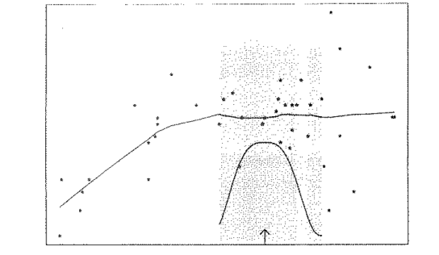

#Introdução

```{r, echo = FALSE, warning=FALSE, message=FALSE}

library(tidyverse)
library(ggpmisc)
library(knitr)
library(kableExtra)
library(lubridate)
library(zoo)
library(fpp2)
library(broom)
```

##Modelo de decomposição da série

$$Z_t = T_t + S_t + a_t,$$
em que $T_t$ e $S_t$ representam a tendência e sazonalidade, enquanto $a_t$ é
um componente aleatório de média zero e variância constante $\sigma_{a}$.

- Supondo que  $a_t$ seja um ruído branco, então $E[a_t, a_s] = 0$,
$s \neq t$. 


---
class: middle

#Tendência

Inicialmente, vamos supor ausência de sazonalidade

$$Z_t = T_t + a_t$$
em que $a_t$ é ruído branco, com variância $\sigma_{a}^2$.

##Métodos

- Suavização por meio de médias móveis
- Ajuste de um modelo de regressão linear paramétrico ( polinomial, exponencial e etc)
- Ajuste de um modelo de regressão linear não paramétrico ("lowess")

---
# Tendência Polinomial

## Modelo Polinomial

$$T_t = \beta_0 + \beta_1 t + \ldots + \beta_m t^m$$

##Estimação - Método dos Minímos Quadrados

Minimizar

$$Q = \sum_{t=1}^N(Z_t - \beta_0 - \beta_1 t - \ldots - \beta_m t^m)^2,$$
obtendo-se estimadores de mínimos quadrados usuais $\hat{ \beta_0 }, \ldots, \hat{ \beta_m }$.


---
## Modelo Linear

$$T_t = \beta_0 + \beta_1 t$$

###Método dos Mínimos Quadrados

Minimizar

$$Q(\beta_0, \beta_1) = \sum_{t=1}^N(Z_t - \beta_0 - \beta_1 t)^2,$$
###Equações Normais

\begin{align}
N\hat{\beta}_0 + \hat{\beta}_1\sum_{i=1}^Nt &=& \sum_{t=1}^N Z_t \\
\hat{\beta}_0 \sum_{t=1}^N t + \hat{\beta}_1 \sum_{t=1}^N t^2 &=& \sum_{t=1}^N t Z_t 
\end{align}


---
class: middle
##Estimadores de Mínimos Quadrados

\begin{align}
\hat{\beta}_0 &=& \bar{Z} - \hat{\beta_1} \bar{t} \\
\hat{\beta}_1 &=& \frac{\sum_{t=1}^N t Z_t - \left[ \left( \sum_{t=1}^N t\right) \left( \sum_{t=1}^N Z_t\right)  \right] }{\sum_{t=1}^N t^2 - \left(\sum_{t=1}^N t \right)^2}
\end{align}


---
####Consumo de energia elétrica no Espírito Santo (Jan 1977 - Dez 1978)

```{r, echo = FALSE,warning=FALSE,message=FALSE}

dat = tibble(
  tempo = 1:24,
  resp = c(84.6, 89.9, 81.9, 95.4, 91.2, 89.8, 89.7, 97.9, 103.4,107.6, 120.4,109.6,
           110.3, 118.1, 116.5, 134.2, 134.7, 144.8, 144.4,159.2, 168.2, 175.2, 174.5, 173.7)
)

my.formula = y ~ x

ggplot(dat, aes(x = tempo, y = resp) ) +
     geom_smooth(method = "lm", se=FALSE, color="black", formula = my.formula) +
     stat_poly_eq(formula = my.formula,
                eq.with.lhs = "italic(y)~'='~",
                eq.x.rhs = "~italic(z)",
                aes(label = ..eq.label..), 
                parse = TRUE) + 
   labs(x = expression(italic(z)), y = expression(italic(y))) +    
   geom_point() +theme_bw()

```


---
###Estimativas do Modelo

```{r, echo = FALSE, message=FALSE, warning=FALSE}

tidy(lm(resp ~ tempo, data = dat))

```


###Intervalos de Confiança

```{r, echo = FALSE, message=FALSE, warning=FALSE}

confint(lm(resp ~ tempo, data = dat))

```


---
##Diagnóstico do modelo


```{r, echo = FALSE, message=FALSE, warning=FALSE}


par(mfrow=c(2,1))
qqnorm(residuals(lm(resp ~ tempo, data = dat)))
qqline(residuals(lm(resp ~ tempo, data = dat)))
acf(residuals(lm(resp ~ tempo, data = dat)))


```

---
##Previsão do comsumo de energia elétrica do período de (Jan 1979 - Abril 1979)

$$\hat{T}_t = 68.4 + 4.2 t$$


```{r, echo = FALSE, message=FALSE, warning=FALSE}

mod = lm(resp ~ tempo, data = dat)
predicao = predict(mod, data.frame(tempo = 25:28))

tab1 = data.frame(
  'datas' = seq(ymd("1979-01-01"), 
              ymd("1979-04-01"), by="month"),
  'valor real' = c(179.8,185.8, 270.3,196.9),
  'valor predito' = predicao
)
  
kable(tab1)
```

---
####Suavização - Médias Móveis

$$Z^{*}_t = {\cal F}[Z_t], \phantom{111} t = 1, \ldots, N.$$
em que 

$$Z^{*}_t = \sum_{j= -n}^n c_j Z_{t+j}, \phantom{11} t = n + 1, \ldots, N - n.$$


Normalmente, $c_j$ é escolhido de tal forma que 

$$Z^{*}_{t} = \frac{1}{2 n + 1}\sum_{j=-n}^n Z_{t+j}.$$
####Número de termos par

- Quando o número de termos de uma média móvel for par, a fórmula $Z^{*}_{t} = \frac{1}{2 n + 1}\sum_{j=-n}^n Z_{t+j}$ não se aplica.

- Assim, para centrar em um instante de tempo dado, considera-se cada termo da média móvel como média de duas observações sucessivas.

---
### Propriedades Estatísticas

\begin{align}
Z_t^{*} =& \sum_{j= -n}^n c_j Z_{t+j} \\
=& \sum_{j = -n}^n c_j [T_{t+j} + a_{t+j}] \\
=& \sum_{j = -n}^n c_j T_{t+j} + \sum_{j = -n}^n a_{t+j}.
\end{align}

Ou seja,

$$Z_t^{*} = \sum_{j= -n}^n c_j Z_{t+j} + a_{t}^{*},$$
onde 

$$a_{t}^{*} = \sum_{j= -n}^n c_j a_{t+j}.$$
---
class: middle

Como $E(a_t^{*}) = 0,$ pois $E(a_t) = 0$, para todo $t$, segue-se que:

$$E(Z_t^{*}) = \sum_{j= -n}^n c_j Z_{t+j} \approx  \sum_{j= -n}^n c_j Z_{t} = T_t = E(Z_t).$$
dado que $T_{t+j} \approx T_t.$, supondo -se a tendência "suave".

---
##Suavização - Médias Móveis 

###Consumo de energia elétrica
```{r, echo = FALSE, message=FALSE, warning=FALSE}

tab2 = data.frame(
  'datas' = seq(ymd("1977-01-01"), 
                ymd("1977-07-01"), by="month"),
  'valor real' = c(84.6,89.9,81.9,95.4,91.2,89.8,89.7)
)
  
kable(tab2)
```

---
##Suavização - Médias Móveis 

####Cálculo com médias móveis com três termos $(n = 1)$ e $t=2$

$$Z^{*}_2 = \frac{1}{3}(Z_1 + Z_2 + Z_3) = \frac{1}{3}(84.6+89.9+81.9) = 85.46667$$
####Cálculo com médias móveis com quatro termos e $t=3$

\begin{align}
Z^{*}_3 =& \frac{1}{4}\left[ \frac{Z_1 + Z_2}{2} +  \frac{Z_2 + Z_3}{2} +  \frac{Z_3 + Z_4}{2} +  \frac{Z_4 + Z_5}{2} \right] \\
=& \frac{1}{4}\left[ \frac{84.6+89.9}{2} +  \frac{89.9+81.9}{2} + \frac{81.9+95.4}{2} + \frac{95.4+91.2}{2}\right] = 88.775
\end{align}


---
##Suavização - Médias Móveis (Exemplo no R)

```{r, echo = FALSE, message = FALSE, warning = FALSE}

tab3 = data.frame(
  'datas' = seq(ymd("1977-01-01"), 
                ymd("1977-07-01"), by="month"),
  'valor real' = c(84.6,89.9,81.9,95.4,91.2,89.8,89.7),
  'média móvel 3' = ma(c(84.6,89.9,81.9,95.4,91.2,89.8,89.7),order = 3, centre=TRUE),
  'média móvel 4' = ma(c(84.6,89.9,81.9,95.4,91.2,89.8,89.7),order = 4, centre=TRUE)
)
  
kable(tab3)


```


---
##Suavização - Médias Móveis (Exemplo no R)

```{r, echo = FALSE, message = FALSE, warning = FALSE}

dat$mm3 = as.vector(ma(dat$resp, order=3, centre=FALSE))

ggplot(dat, aes(tempo, resp)) + 
  geom_point(position=position_jitter(1,3), pch=21, fill="#FF0000AA") +
  geom_line(aes(y=mm3)) +
  theme_bw()

```

---
class: middle
##Suavização - Médias Móveis 

Segundo Anderson (1971), há algumas desvantagens:

1.  Inferências estatísticas derivadas do método são limitadas, dado que ele não é baseado em nenhum modelo probabilístico;

2.  Não podemos obter as estimativas da tendência nos instantes $t = 1, \ldots, n$ e $t = N - n + 1, \ldots, N$.

3.  Não fornece um meio de fazer previsões.

---
class: middle
##Suavização - Regressão Não Paramétrica "lowess" (Hastie et. al. 1990)

####Motivação 

- Um dos modelos mais populares em análise de dados é o modelo de regressão linear

$$y_i = \beta_0 + \beta_1 x_i + \epsilon_i.$$
- Ainda, sabemos que podemos ajustar polinômios ou ainda, modelos não lineares, nesse caso podemos escrever

$$y_i = h(x_i) + \epsilon_i.$$

- No entanto, para todos esses modelos precisamos saber de antemão a forma da função $h(x)$.

- Nos modelos não paramétricos a ideia é "*deixe os dados mostrar-nos a forma apropriada da função*"

---
###Curva Lowess



---
class: middle
##Suavização - Regressão Não Paramétrica "lowess"

- Lowess significa "locally weighted regression scatter plot smoothing";
- Isto significa que a suavização é feita através de sucessivos ajustes de retas de mínimos quadrados.

####Método

- Vamos assistir um vídeo para começar a discussão do método [lowess](https://www.youtube.com/watch?v=Vf7oJ6z2LCc).


---
class: middle
###Lowess - Método

- Considere uma série temporal $Z_1, \ldots, Z_N$ em que objetiva-se obter o par $(t_j, \hat{Z}_j)$, sendo $\hat{Z}_j$ o valor suavizado.
- Inicialmente, considere uma faixa vertical centrada em $(t_j, Z_j)$, contendo $q$ pontos.
- De modo geral, escolhemos $q = [p N]$, em que $p$ é a proporção de pontos na faixa, $0 < p < 1$.

---
class: middle
###Lowess - Método


- Definimos pesos para os pontos vizinhos de $(t_j, Z_j)$, dentro da faixa. O ponto referência tem maior peso.

- Para os pontos vizinhos tem-se que o valor do peso é em função da distância com relação ao ponto de referência.Quanto maior a distância, menor o peso.

- Usamos uma função peso simétrica ao redor de $t_j$, por exemplo:

####Função peso:  tri-cúbica

\begin{align}
h_{(u)} = \left\{\begin{array}{cc} 
(1 - |u|^3)^3,   & \mbox{se} |u| < 1 \\
0,               & c.c.   
\end{array}\right.
\end{align}

- O peso atribuído a $(t_k, Z_k)$ será $h_j(t_k) = h\left(\frac{t_j - t_k}{d_j}\right)$, em que $d_j$ é distância de $t_j$ ao seu vizinho mais afastado dentro da faixa.


---
class: middle
###Lowess - Método


- Ajustamos uma reta $Z = a + bt + \epsilon$ aos $q$ pontos usando o método dos mínimos quadrados ponderados, ou seja, 

$$\mbox{MMQ}: (\hat{a}, \hat{b}) = \mbox{argmin} \sum_{k=1}^q h_j(t_k)(Z_k - a - bt_k)^2,$$

- O valor suavizado de $Z_j$ é dado por:

$$\hat{Z}_j = \hat{a} + \hat{b}t_j, \phantom{111} j = 1, \ldots, N.$$


---
###Lowess - Procedimento Robusto

- Se tivermos valores discrepantes pode-se proceder da seguinte forma:
- Calcula-se os resíduos:

$$r_i = Z_i - \hat{Z_i}, \phantom{iii} i = 1, \ldots, N.$$

- Define-se novos pesos, baseados nos valores dos resíduos, de modo que pontos 
com resíduos grandes tenham pesos pequenos e vice-versa.

- Estes novos pesos robustos podem ser dados por exemplo pela função bi quadrática

\begin{align}
g_(u) = \left\{\begin{array}{cc} 
(1 - |u|^2)^2,   & \mbox{se} |u| < 1 \\
0,               & c.c.   
\end{array}\right.
\end{align}

- Seja $m$ a mediana dos valores absolutos dos resíduos, $r_i$. O peso robusto atribuído a $(t_k, Z_k)$ é $g(t_k) = g\left(\frac{r_k}{6m}\right)$.

---
class: middle
###Lowess - Procedimento Robusto
 
- Finalmente, ajusta-se uma nota reta aos $q$ pontos, ou seja 

$$\mbox{MMQ}: (\hat{a}, \hat{b}) = \mbox{argmin} \sum_{k=1}^q h_j(t_k)g_j(t_k) (Z_k - a - bt_k)^2,$$

- Segue que se $(t_k, Z_k)$ for discrepante, $r_k$ será grande e o peso final será pequeno.

- O procedimento deve ser repetido duas ou mais vezes (em geral, procedimentos robustos envolvem iterações)

